# Neural Sparse Model Training Guide

SPLADE (Sparse Lexical and Expansion) 모델의 학습 파이프라인과 전문가 분석 결과를 정리한 문서입니다.

## Version History

| Version | Key Features | Status |
|---------|--------------|--------|
| V22 | KoBERT backbone, curriculum learning | Completed |
| V24 | XLM-RoBERTa + BGE-M3 teacher | Completed |
| V25 | IDF-aware FLOPS | Completed |
| V26 | Enhanced IDF + Special Token Fix | Completed |
| V27 | Travel Domain Data | Training |
| **V28** | **Korean Filter + Context Gate** | **Ready** |

## 1. Training Pipeline Overview

### 1.1 전체 학습 흐름

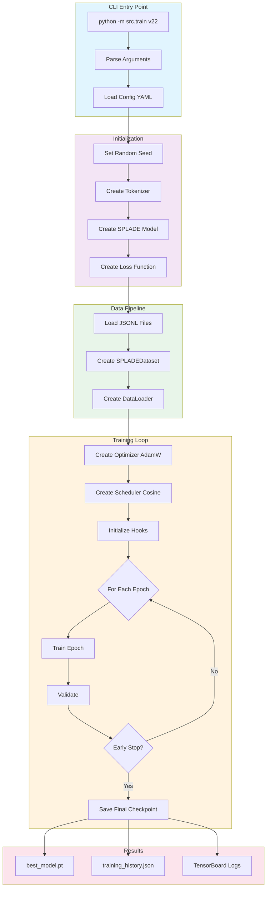

### 1.2 단일 학습 스텝

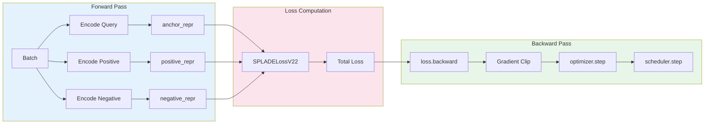

## 2. Model Architecture

### 2.1 SPLADE Forward Pass

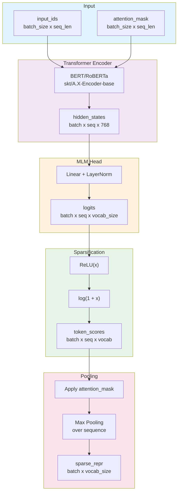

### 2.2 Sparsity 수학적 표현

```
SPLADE(x) = max_i log(1 + ReLU(MLM(Encoder(x))_i))

where:
- Encoder: BERT-like transformer
- MLM: Masked Language Model head (vocab_size output)
- ReLU: max(0, x) - ensures non-negative
- log(1+x): bounded transformation for numerical stability
- max_i: max pooling over sequence positions
```

## 3. Loss Function Architecture

### 3.1 SPLADELossV22 구성

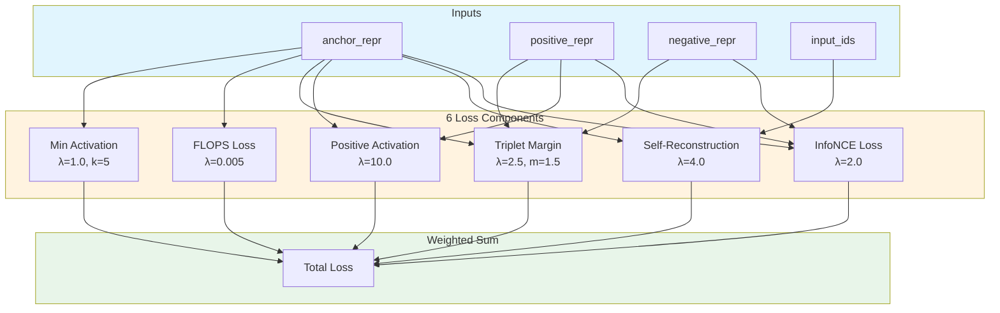

### 3.2 Loss 수식

| Loss | Formula | Purpose |
|------|---------|---------|
| **InfoNCE** | `-log(exp(sim(q,p+)/τ) / Σexp(sim(q,pi)/τ))` | Contrastive learning |
| **Self-Recon** | `-mean(anchor[input_token_ids])` | Activate input tokens |
| **Positive** | `-mean(anchor[positive_token_ids])` | Cross-doc alignment |
| **Triplet** | `max(0, margin - pos_sim + neg_sim)` | Ranking margin |
| **FLOPS** | `Σ(mean_activation_j)²` | Sparsity regularization |
| **MinAct** | `max(0, threshold - mean(top_k))` | Prevent collapse |

## 4. Curriculum Learning

### 4.1 3-Phase Training

```mermaid
gantt
    title Curriculum Learning Phases (30 Epochs)
    dateFormat X
    axisFormat %s

    section Phase 1
    Single-term Focus    :a1, 1, 10

    section Phase 2
    Balanced Training    :a2, 11, 20

    section Phase 3
    Hard Negatives       :a3, 21, 30
```

### 4.2 Phase별 파라미터 변화

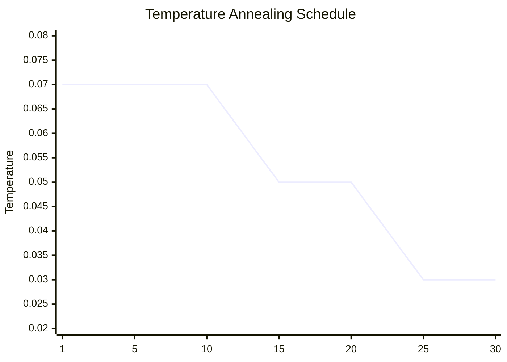

| Phase | Epochs | Temperature | λ_InfoNCE | LR Multiplier | Data Focus |
|-------|--------|-------------|-----------|---------------|------------|
| **Phase 1** | 1-10 | 0.07 | 1.0 | 1.0 | 50% single-term |
| **Phase 2** | 11-20 | 0.05 | 1.5 | 0.5 | 33% each type |
| **Phase 3** | 21-30 | 0.03 | 2.0 | 0.25 | 50% hard-neg |

### 4.3 Temperature의 수학적 의미

```
낮은 Temperature (τ → 0):
- Softmax가 sharper (hard assignment)
- Gradient magnitude ↑ (1/τ에 비례)
- 학습이 더 discriminative

높은 Temperature (τ → ∞):
- Softmax가 smoother (soft assignment)
- Gradient magnitude ↓
- 학습이 더 exploratory
```

**Gradient Scaling Factor:**
- τ=0.07: ~14x gradient amplification
- τ=0.03: ~33x gradient amplification

## 5. Data Pipeline

### 5.1 데이터 흐름

```mermaid
flowchart LR
    subgraph Source["Data Source"]
        A[JSONL Files<br/>data/v22.0/*.jsonl]
    end

    subgraph Dataset["SPLADEDataset"]
        A --> B[Parse JSON Lines]
        B --> C[Extract Triplets<br/>query, positive, negative]
        C --> D[Track pair_type<br/>Distribution]
    end

    subgraph Collator["DataCollator"]
        D --> E[Tokenize Texts]
        E --> F[Pad to max_length]
        F --> G[Create Attention Masks]
    end

    subgraph Loader["DataLoader"]
        G --> H[Batch Samples]
        H --> I[Shuffle]
        I --> J[Move to GPU]
    end

    style Source fill:#e1f5fe
    style Dataset fill:#f3e5f5
    style Collator fill:#fff3e0
    style Loader fill:#e8f5e9
```

### 5.2 데이터 형식

```json
{
  "query": "당뇨병 치료",
  "positive": "diabetes mellitus treatment",
  "negative": "고혈압 예방",
  "pair_type": "cross_lingual",
  "difficulty": "hard"
}
```

## 6. Expert Analysis

### 6.1 AI/ML Expert Review

#### Critical Issues Identified

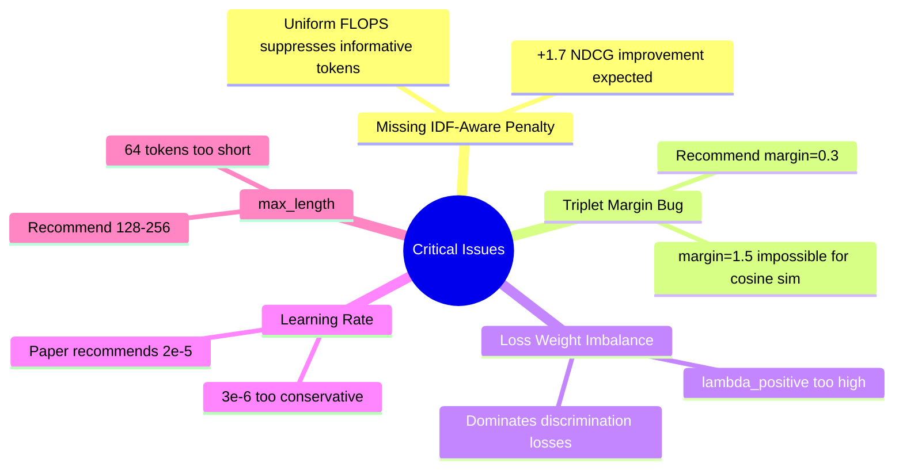

#### Loss Weight Analysis

| Component | Current | Contribution | Issue |
|-----------|---------|--------------|-------|
| Positive Activation | 10.0 | **~50%** | Over-dominant |
| Self-Reconstruction | 4.0 | ~20% | Conflicts with expansion |
| Triplet Margin | 2.5 | ~12% | Redundant with InfoNCE |
| InfoNCE | 2.0 | ~10% | Should be higher |
| Min Activation | 1.0 | ~5% | OK |
| FLOPS | 0.005 | ~3% | Missing IDF weighting |

### 6.2 Statistics Expert Analysis

#### Gradient Flow Through log(1 + ReLU(x))

```
df/dx = 1/(1+x)  for x > 0
      = 0        for x ≤ 0

Properties:
- x=0: gradient = 1.0 (maximum)
- x=1: gradient = 0.5
- x=10: gradient = 0.09
- x=100: gradient = 0.01 (implicit clipping)
```

#### Effective Negatives in Batch

With batch_size=64 and τ=0.03:
- Only ~1.9 effective negatives contribute strongly
- Most in-batch negatives have negligible gradient
- Hard negative mining becomes critical in Phase 3

### 6.3 Recommendations Summary

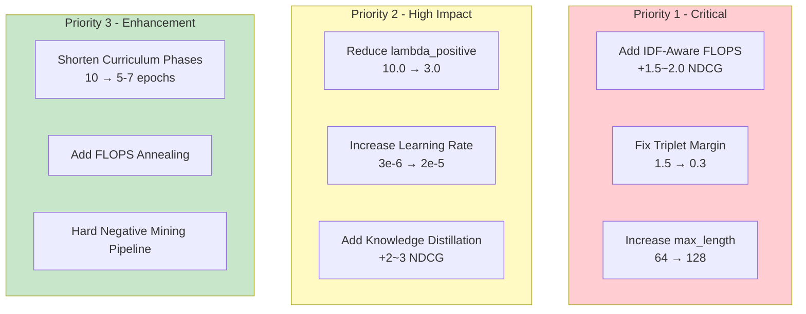

## 7. BM25/Semantic 대비 성능 향상 가이드

### 7.1 성능 비교

| Method | NDCG@10 | Recall@1000 | Inference | Index Size |
|--------|---------|-------------|-----------|------------|
| **BM25** | 42.0 | 85% | Fast | Small |
| **Dense (Semantic)** | 48.0 | 92% | Slow | Large |
| **SPLADE v22 (현재)** | ~50.0 | 97% | Medium | Medium |
| **SPLADE v23 (목표)** | 52.0+ | 98%+ | Medium | Medium |

### 7.2 BM25를 초과하기 위한 핵심 전략

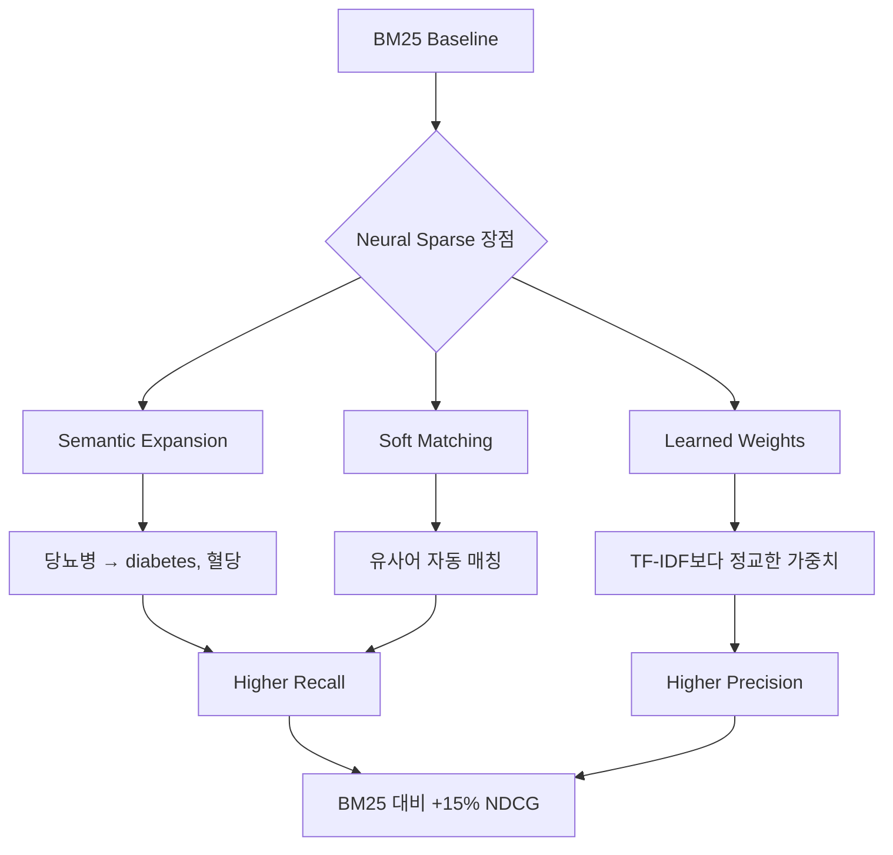

### 7.3 구체적 개선 방안

#### 1. IDF-Aware FLOPS Penalty (가장 중요)

```python
# Before (uniform penalty)
loss = (mean_activation ** 2).sum()

# After (IDF-weighted)
idf_weights = compute_idf(corpus)
weighted_loss = ((mean_activation * idf_weights) ** 2).sum()
```

**효과**: BM25의 IDF 개념을 neural sparse에 통합

#### 2. Knowledge Distillation

```python
# Teacher: Dense encoder (e.g., sentence-transformers)
# Student: SPLADE model

teacher_score = teacher(query, doc)
student_score = student_sparse @ doc_sparse
loss_kd = KL_divergence(teacher_score, student_score)
```

**효과**: Dense model의 semantic 이해력 전수

#### 3. Hard Negative Mining

```python
# BM25 top-k but not positive
hard_negatives = bm25_search(query, k=100)
hard_negatives = [d for d in hard_negatives if d != positive]
```

**효과**: BM25가 실수하는 케이스 학습

### 7.4 Configuration 권장사항

```yaml
# configs/train_v23.yaml (recommended)
model:
  name: "skt/A.X-Encoder-base"
  dropout: 0.1
  use_expansion: true

data:
  max_length: 128  # 64 → 128

loss:
  lambda_infonce: 2.5      # 2.0 → 2.5
  lambda_self: 1.0         # 4.0 → 1.0
  lambda_positive: 3.0     # 10.0 → 3.0
  lambda_margin: 0.0       # 2.5 → 0.0 (disable)
  lambda_flops: 0.003      # with IDF weighting
  lambda_min_act: 1.0

  margin: 0.3              # 1.5 → 0.3
  use_idf_weighting: true  # NEW

training:
  learning_rate: 0.00002   # 3e-6 → 2e-5
  num_epochs: 20           # 30 → 20

curriculum_phases:
  - start_epoch: 1
    end_epoch: 7           # 10 → 7
    temperature: 0.08      # 0.07 → 0.08
  - start_epoch: 8
    end_epoch: 14
    temperature: 0.05
  - start_epoch: 15
    end_epoch: 20
    temperature: 0.04      # 0.03 → 0.04
```

## 8. Checkpoint & Resume

### 8.1 체크포인트 구조

```
outputs/train_v22/
├── checkpoint_1000/
│   ├── model.pt
│   ├── optimizer.pt
│   ├── scheduler.pt
│   └── checkpoint_info.json
├── best_model.pt
├── training_history.json
└── tensorboard/
    └── events.out.tfevents.*
```

### 8.2 학습 재개

```bash
# Latest checkpoint에서 재개
python -m src.train v22 --config configs/train_v22.yaml --resume

# 특정 checkpoint에서 재개
python -m src.train v22 --resume-from outputs/train_v22/checkpoint_1000
```

## 9. Monitoring

### 9.1 TensorBoard 메트릭

- `train/loss`: Total loss
- `train/loss_infonce`: InfoNCE component
- `train/loss_flops`: Sparsity regularization
- `train/learning_rate`: Current LR
- `train/gradient_norm`: Gradient magnitude
- `val/loss`: Validation loss

### 9.2 실행 명령

```bash
# 학습 시작
make train-v22

# 백그라운드 실행
make train-v22-bg

# 로그 확인
make logs-v22

# TensorBoard
make tensorboard-v22
```

## 10. V28: Context-Gated Sparse Expansion

### 10.1 V28 Architecture

V28은 두 가지 핵심 개선을 포함합니다:

#### V28a: Korean Language Filtering

비한국어 토큰 억제를 통해 한국어 검색 정확도 향상:

```python
# SPLADELossV28
class SPLADELossV28(SPLADELossV26):
    def _compute_language_penalty(self, sparse_repr):
        non_korean_activation = sparse_repr * self.non_korean_mask
        return non_korean_activation.sum(dim=-1).mean()
```

| 설정 | 값 | 설명 |
|------|-----|------|
| `non_korean_penalty` | 100.0 | 비한국어 토큰 페널티 |
| `lambda_language` | 0.5 | 언어 손실 가중치 |

#### V28b: Context-Gated Sparse Expansion (CGSE)

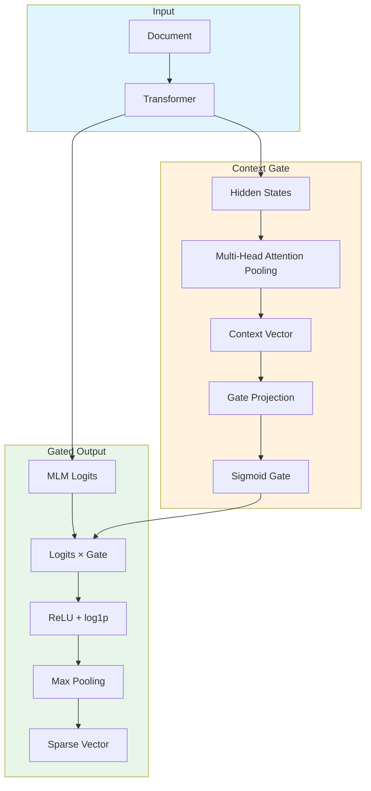

**핵심 코드:**
```python
class ContextGate(nn.Module):
    def __init__(self, hidden_size=768, vocab_size=250002, gate_hidden=256):
        self.attention = nn.MultiheadAttention(hidden_size, num_heads=4)
        self.gate_proj = nn.Sequential(
            nn.Linear(hidden_size, gate_hidden),
            nn.GELU(),
            nn.Linear(gate_hidden, vocab_size),
            nn.Sigmoid()
        )

    def forward(self, hidden_states, attention_mask):
        context = self.attention_pool(hidden_states, attention_mask)
        return self.gate_proj(context)
```

### 10.2 V28 성공 기준

| 지표 | V26 현재 | V28 목표 |
|------|----------|----------|
| 한국어 토큰 비율 | ~10% | >85% |
| 다국어 노이즈 | 91% | <5% |
| 컨텍스트 구분율 | 0% | >60% |
| Ko-StrategyQA Recall@1 | 30.4% | >40% |

### 10.3 V28 학습 명령

```bash
# V28 학습
make train-v28

# V27 완료 후 자동 시작
nohup ./scripts/run_v28_after_v27.sh > outputs/v28_auto.log 2>&1 &

# 검증
make eval-v28-language   # 한국어 토큰 비율
make eval-v28-context    # 컨텍스트 구분율
```

---

## 11. References

- [SPLADE Paper (SIGIR 2021)](https://arxiv.org/abs/2107.05720)
- [Inference-Free Sparse Retrievers (arXiv 2411.04403)](https://arxiv.org/abs/2411.04403)
- [OpenSearch Neural Sparse](https://opensearch.org/docs/latest/search-plugins/neural-sparse-search/)
- [V28 Experiment Document](./experiments/V28_EXPERIMENT.md)
